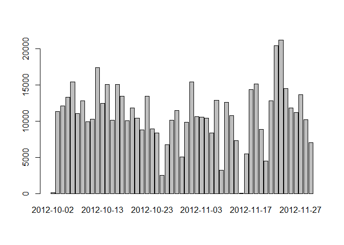
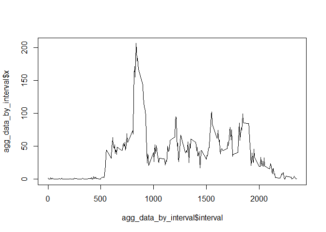
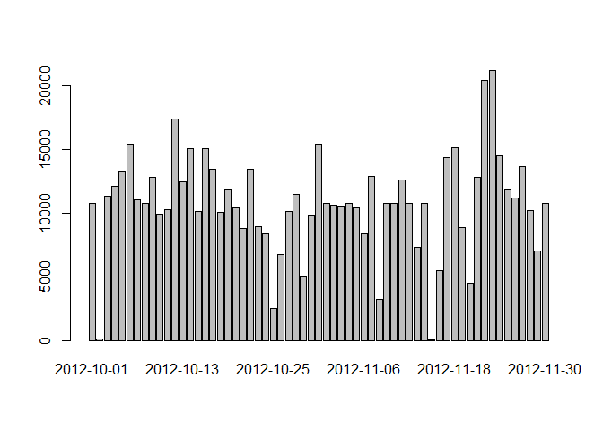
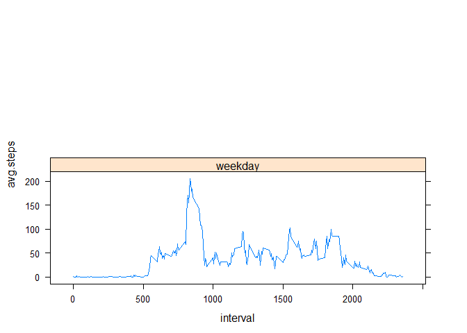

# Reproducible Research: Peer Assessment 1
## Loading and preprocessing the data


```r
## Unzip and reading of data
unzip("activity.zip", exdir="tempdir")
data <- read.csv("tempdir/activity.csv")
## Data Frame without NAs
data_wo_nas <- data[complete.cases(data[,1]),]
```

## What is the mean of the total number of steps taken per day?

## Histogram:


```r
## Aggregation of data
agg_data <- aggregate(data_wo_nas$steps, by=list(date=data_wo_nas$date), FUN=sum)
## Barplot
barplot(agg_data$x, names=agg_data$date)
```

 

```r
## Mean and median
mean_steps_by_day <- mean(agg_data$x)
median_steps_by_day <- median(agg_data$x)
```

The mean of the total number of steps taken per day is mean_steps_by_day.
The median of the total number of steps taken por day is median_steps_by_day.

## What is the average daily activity pattern?


```r
## Aggregation by interval
agg_data_by_interval <- aggregate(data_wo_nas$steps, by=list(interval=data_wo_nas$interval), FUN=mean)
## Plot
plot(agg_data_by_interval$interval, agg_data_by_interval$x, type="l")
```

 

```r
## Interval with máximun number of steps
interval_max_steps <- 
        agg_data_by_interval$interval[agg_data_by_interval$x==max(agg_data_by_interval$x)]
```

The 5-minute interval which contains on average the maximum number of steps across all the days is interval_max_steps.

## Imputing missing values


```r
# Get number of missing values
missing_values <-  nrow(data[is.na(data$steps),])
# New data frame substituing missing values
fix_data<-data
agg<-agg_data_by_interval
fill <- function(interval, agg) agg[agg$interval==interval,2]
fix_data[is.na(fix_data$steps),1]<-sapply(fix_data[is.na(fix_data$steps),3], FUN=fill, agg=agg)
# Histogram of total number of steps taken each day
agg_fix_data <- aggregate(fix_data$steps, by=list(date=fix_data$date), FUN=sum)
barplot(agg_fix_data$x, names=agg_fix_data$date)
```

 

```r
# Mean and median of total number of steps taken each day
fix_mean_steps_by_day <- mean(agg_fix_data$x)
fix_median_steps_by_day <- median(agg_fix_data$x)
```

The total number of missing values is missing_values.

For filling the missing values, we will use the mean of the 5-minute interval in which they were found. Whith these filled values we get the following data:
- Mean of the total number of steps taken per day: fix_mean_steps_by_day.
- Median of the total number of steps taken por day: r fix_median_steps_by_day.

## Are there differences in activity patterns between weekdays and weekends?


```r
fix_data$weekday <- weekdays(as.Date(fix_data$date))
fix_data[fix_data$weekday==c("sábado","domingo"),"weekday"]<-"weekend"
fix_data[fix_data$weekday!=c("weekend"),"weekday"]<-"weekday"
fix_data$weekday <- as.factor(fix_data$weekday)
## Aggregation
agg_fix_data_by_interval_wk <- aggregate(fix_data$steps, by=list(interval=fix_data$interval, weekday=fix_data$weekday), FUN=mean)
agg_fix_data_by_interval_wk <- aggregate(fix_data$steps~interval+weekday, fix_data, FUN=mean)
colnames(agg_fix_data_by_interval_wk)<-c("interval", "weekday", "avg.steps")
## Plot
library(lattice)
xyplot(avg.steps~interval | weekday, agg_fix_data_by_interval_wk, type="l", layout=c(1,2))
```

 
